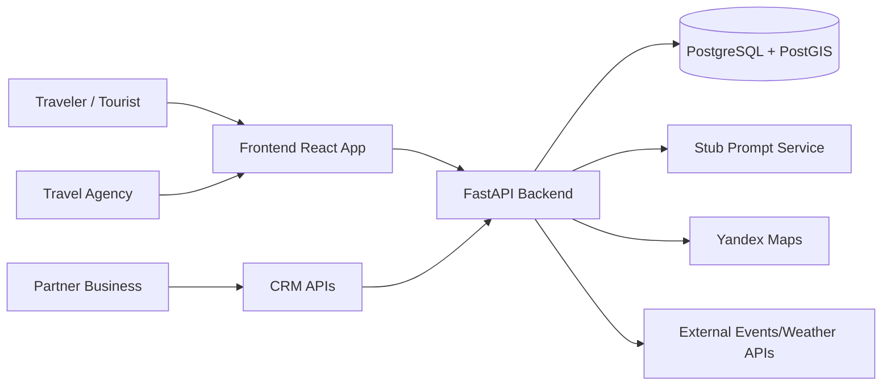
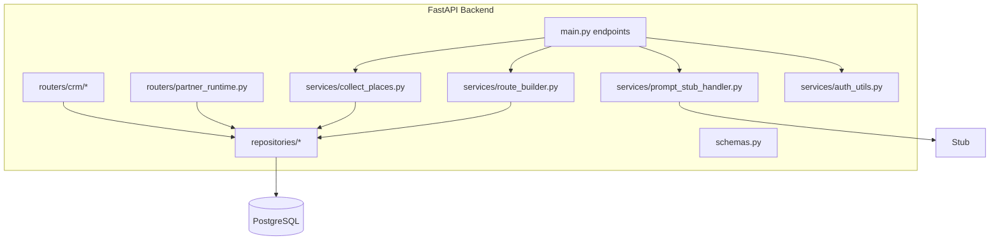
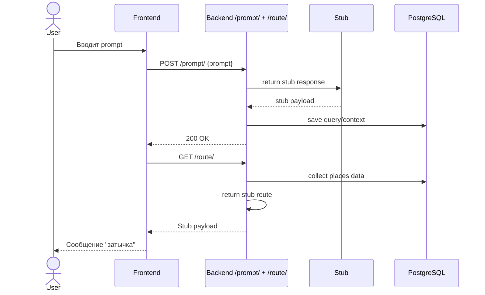
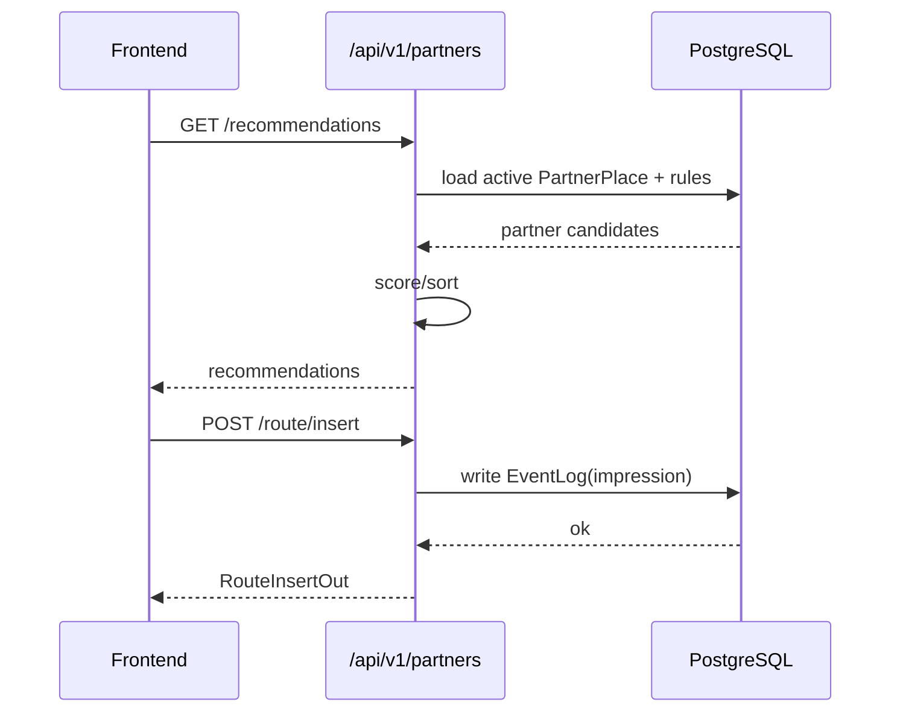
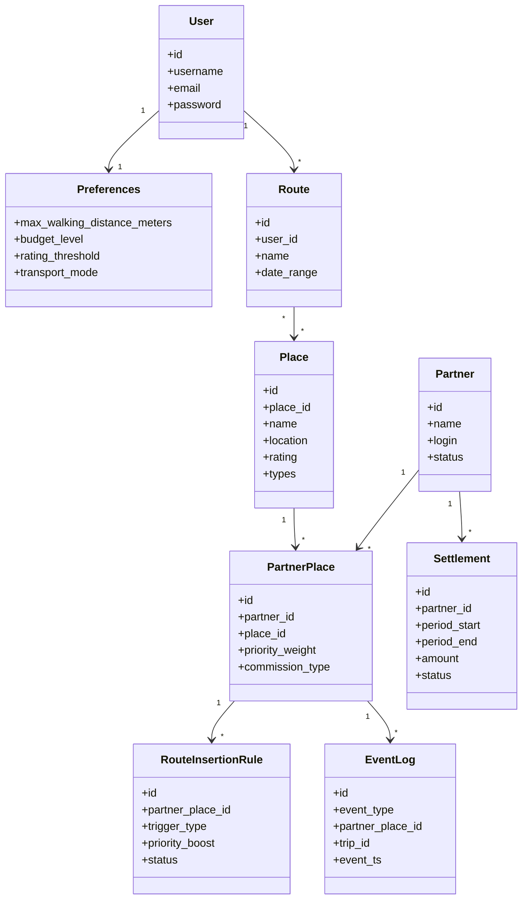

# Architecture and UML (Textual)

Ниже текстовые UML-диаграммы в формате Mermaid (можно рендерить в большинстве markdown-viewers).

## 1) System Context (C4-like)

## 2) Backend Component Diagram

## 3) Sequence: Route Generation (User)

## 4) Sequence: Partner Insertion Flow

## 5) Domain/Class Diagram (Core entities)

## 6) Textual Architecture Description

- Стиль: layered monolith (FastAPI) с выделенными слоями routers/services/repositories.
- Data store: PostgreSQL + PostGIS для гео-операций (`ST_DWithin`, точки маршрута).
- AI orchestration: `prompt -> parse -> collect -> build route`.
- CRM and runtime partner recommendations изолированы в `/api/v1/crm/*` и `/api/v1/partners/*`.
- Auth: JWT Bearer для пользовательского контура и login для партнерского контура.
- Guest mode: контекст запроса хранится по IP, затем используется для `GET /route/`.

## 7) Architectural Constraints

- Не смешивать бизнес-логику и HTTP-слой.
- Все внешние зависимости (AI/maps/events) должны иметь обработку таймаутов/ошибок.
- Контракты DTO фиксируются в `schemas.py`.
- Все изменения endpoint-ов должны синхронизироваться с `docs/contracts/api-contracts.md`.
